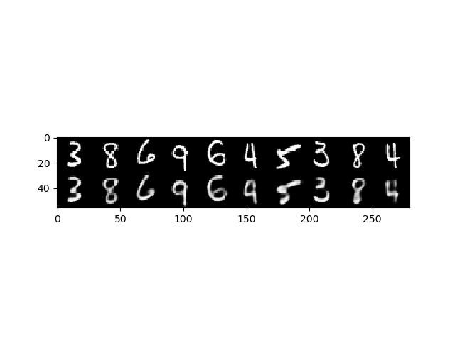

# ConvolutionalAutoEncoder
A very simple convolutional autoencoder implemented in lasagne, applied to MNIST as an example


## Requirements
Lasagne
```git clone https://github.com/Lasagne/Lasagne.git```\n
```cd Lasagne```\n
```pip install -r requirements.txt```\n
```pip install . ```\n
